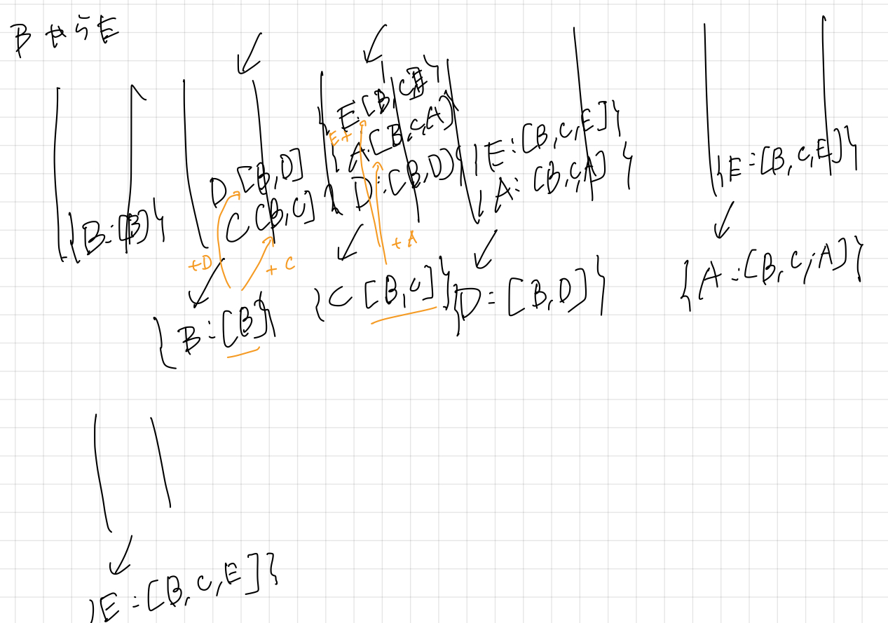

# グラフアルゴリズム

## 宿題

### `wikipedia.py`のわからなかった部分

```python
assert id not in self.titles, id
```

<br>

`assert`文：

```python
assert 条件式, エラーメッセージ
```

条件式が`False`の時、`AssertionError`とともにエラーメッセージが表示される。

`in dic`：

辞書のキーを調べる。  
値を調べるには`dic.values()`

よって、すでに`id`が辞書のキーの中に存在する場合、`AssertionError`が起こる

<br>

### 宿題1

スタートのタイトルとゴールのタイトルを受け取って、それらの最短経路のタイトル（またはID？）を表示するような関数`find_shortest_path()`を書く

よくわからないので、まずBFSで経路が発見できるような関数を書く

```python
    def find_shortest_path(self, start: str, goal: str) -> None:
        for id, title in self.titles.items():
            if title == start:
                start_id: int = id
            elif title == goal:
                goal_id: int = id

        bfs_que: deque[int] = deque([start_id])
        visited_ln: list[int] = [start_id]
        # 空でない限り回す
        while not len(bfs_que) == 0:
            popped_id: int = bfs_que.pop()
            if popped_id == goal_id:
                print("found")
                return
            # goal_idでないなら追加する
            for id in self.links[popped_id]:
                if id not in visited_ln:
                    bfs_que.append(id)
                    visited_ln.append(id)

        print("not found")
        return
```

キューに格納するデータとして、今見ているidをkey, そこまでの経路のリストをvalueとする辞書を格納すれば良いのではないかと考えた



よって、キューに保存するデータは以下のようになる

```python
{id: popped_list + id}
```

実行結果
```
最短経路：渋谷→マクドナルド→Twitter→パレートの法則
```

### 宿題2

ページランクを実装し、ページランクが最も高い順に10ページ表示するような関数`find_most_popular_pages()`を書く

**ページランクアルゴリズム**

1. 全てのノードのページランクに初期値1を与える
2. 各ノードのページランクの85%を隣接ノードに、残りの10%を隣接していないノードに均等に振り分ける
3. 各ノードのページランクを受け取ったページランクの合計値に更新する
4. 2.3.を収束するまで繰り返す