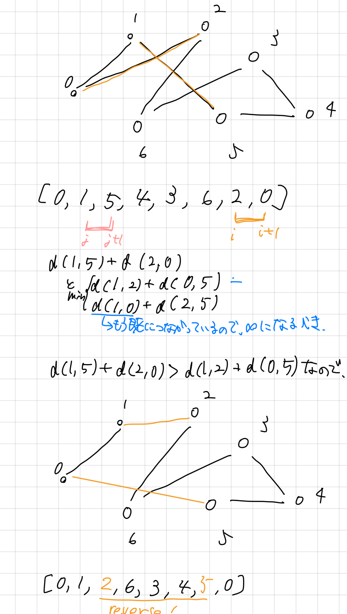
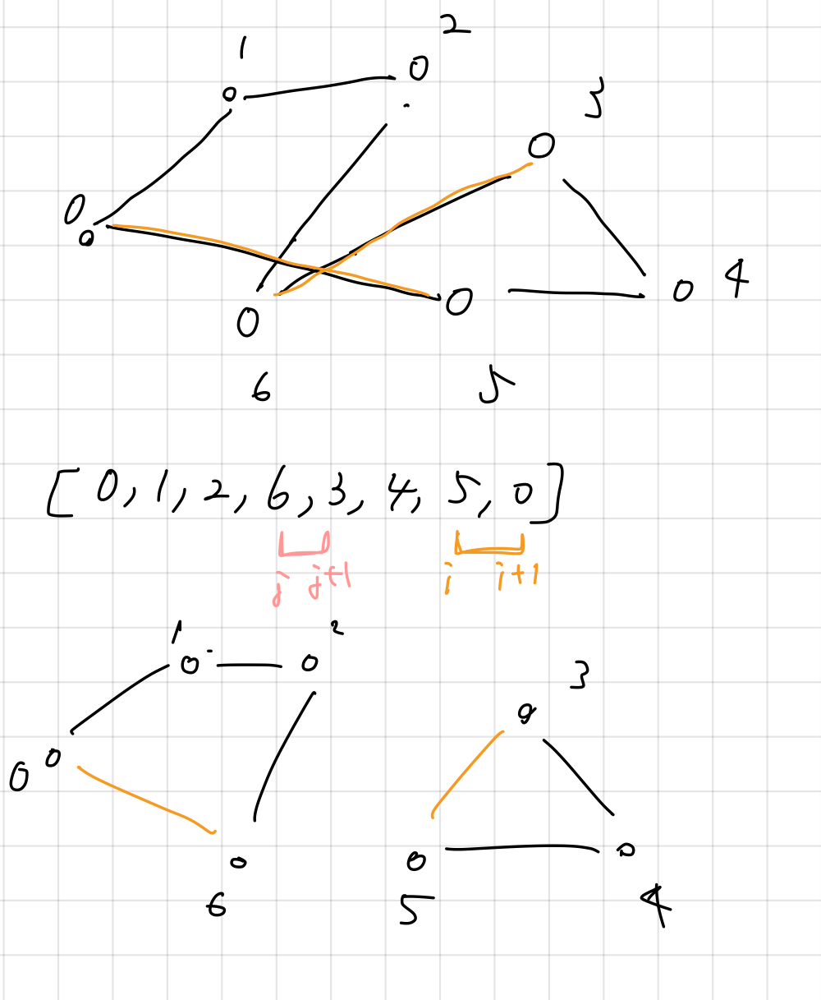

# 計算量理論

## 宿題

### 貪欲法について（サンプル）

**アルゴリズム**

- スタート地点を選ぶ
- すでに選ばれた点を除いて、最後に選ばれた点から最も近いものを選ぶ
- これを点1~nまで行う

### 2-Opt法の実装

**アルゴリズム**

- 適当に巡回の解を出す
- 任意の２本の線について、繋ぎ直すことで改善されるなら繋ぎ直し、されないなら何も操作しない
- これを、改善が見られなくなるまで、もしくは一定回数に到達するまで行う

https://gist.github.com/sekiguchi0731/246f5e7bc92e66c8e82902f2942b003b

**問題点**

random1で行うと、ダブってしまう

```
0
2
6
3
0
7
5
1
4
```

最後に追加したものまで検査対象にしているのが良くない

**修正後**

```
0
4
6
1
5
2
3
7
```

しかし、これを何回か回すと結果が振動してしまう

修正案

1. 結果の履歴を保存するリストを作る
2. そもそも単純にスワップするのが良くないのではないか（調べた。）

<br>

**iとjを繋げるパターン**



つまり、スワップではなく裏返しが必要であったことに気づいた。

また、「すでにつながっていないか？」の確認にはすでに更新したインデックスを参照しなければならないことにも気づいた。

さらに、検査するi, jについては${p_{k-1} - p_{k} - p_{k+1} }$が交差することはないので、ここは検査しなくて良いことに気づいた。

**複数のサイクルができるパターン**



複数のサイクルができてしまう可能性にも気づいた。

これを防ぐために、始点と終点は必ずリストの最初と最後から動かしてはならないという制約を加える。

**問題点**

経路によっては、元の経路よりも長くなってしまう場合がある。

**改善案・修正点**

調べてみると、iと、それより後ろを計算するものが多かったのでそのように改善する

隣接のチェックについて、最初に初項を後ろに一つ足しているので、長さはn + 1となっており、そこの認識の修正を行う

そもそも、初項と末項以外は重複してないから多重辺チェックは不要