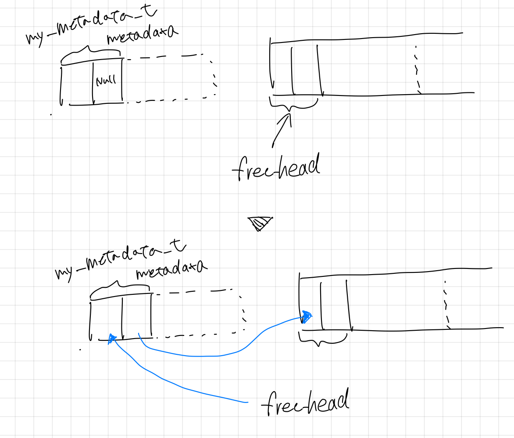
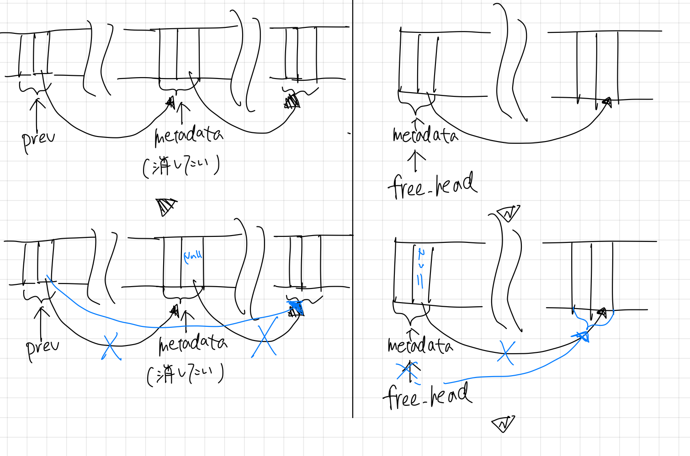

# どうやってプログラムは動いているのか

## 宿題0

### `malloc.c`の解読

#### `my_heap_t`

`my_metadata_t`型のポインタとその中身をセットで持つ構造体

```C
typedef struct my_heap_t {
  my_metadata_t *free_head;
  my_metadata_t dummy;
} my_heap_t;
```

`my_metadata_t`：空き領域の大きさと、次の空き領域をさすポインタの構造体

#### `my_heap_t my_heap`

`my_heap_t`型のファイルスコープの静的変数

#### `void my_add_to_free_list(my_metadata_t *metadata)`

`my_metadata_t`型のポインタ`metadata`を受け取ったら、`metadata`の次へのポインタに今の`my_heap_t`型の静的変数`my_heap`の`free_head`をセットし、現在の`my_heap`の`free_head`を`metadata`に付け替える操作をし、何も返さない関数



```c
void my_add_to_free_list(my_metadata_t *metadata) {
  assert(!metadata->next);
  metadata->next = my_heap.free_head;
  my_heap.free_head = metadata;
}
```

#### `void my_remove_from_free_list(my_metadata_t *metadata, my_metadata_t *prev)`

`my_metadata_t`型のポインタ`metadata`と、その一つ前（＝次へのポインタとして`metadata`を指している）の`my_metadata_t`型のポインタ`prev`を受け取ったら、もし`prev`が存在するならば、`prev`の次へのポインタを`metadata`の次へのポインタに付け替え、存在しないなら`free_head`を`meta_data`の次へのポインタに付け替え、`metadata`の次へのポインタを空にし、何も返さない関数



```c
void my_remove_from_free_list(my_metadata_t *metadata, my_metadata_t *prev) {
  if (prev) {
    prev->next = metadata->next;
  } else {
    my_heap.free_head = metadata->next;
  }
  metadata->next = NULL;
}
```

#### `void *my_malloc(size_t size)`

`size_t`型の`size`を受け取り、任意の型を指すことができる汎用ポインタを返す関数

まず、`metadata`は先頭をさし、`prev`は`NULL`

- `metadata`が存在し、かつ、`metadata`に含まれるサイズが欲しい容量より小さい間、以下を繰り返す
  - `metadata`を一つ前のポインタ、`prev`に代入し、`metadata`として、次のエントリをさす

```c
void *my_malloc(size_t size) {
  my_metadata_t *metadata = my_heap.free_head;
  my_metadata_t *prev = NULL;

  while (metadata && metadata->size < size) {
    prev = metadata;
    metadata = metadata->next;
  }
```

もし`metadata`が存在しない、すなわち求める容量分の空き容量がないとき、以下を行う

- 4096byteの使える連続領域の先頭へのポインタをハードウェアから取得し、それを`my_metadata_t`型にキャストし、`metadata`はそれを指すようにする
- `metadata`のサイズをサイズと次へのポインタ分引いたものに設定し、次へのポインタは`NULL`
- これを、`my_add_to_free_list`に投げる
  - 新しく作った`*metadata`が先頭になる
- `my_heap`を更新し、再び`my_malloc`を実行した結果を返す

```c
  if (!metadata) {
    size_t buffer_size = 4096;
    my_metadata_t *metadata = (my_metadata_t *)mmap_from_system(buffer_size);
    metadata->size = buffer_size - sizeof(my_metadata_t);
    metadata->next = NULL;
    // Add the memory region to the free list.
    my_add_to_free_list(metadata);
    // Now, try my_malloc() again. This should succeed.
    return my_malloc(size);
  }
```

汎用ポインタ`ptr`について、`*metadata`（＝十分な空き容量を持つ領域のうち、最も先頭にあるエントリ）の次の部分（実際の空き領域）のアドレスを指すようにする  
`size_t`型の`remaining_size`に、`*metadata`が持っていた空き容量から使用した容量を引いたものを格納  
`metadata`を削除

もし、使用後に残っている空き容量が、`my_metadata_t`型のサイズよりも大きい時、以下を行う

- `metadata`のサイズを、使用サイズに変更
- 新しい`my_metadata_t`型のポインタ`new_metadata`を、正しいアドレスを指すように
  - 汎用ポインタ`ptr`を、`char *`にキャストすることで、1バイト単位のポインタ演算が可能
- `new_metadata`をフリーリストに追加

使える空き容量の先頭を指す汎用ポインタ`ptr`を返す

```c
  void *ptr = metadata + 1;
  size_t remaining_size = metadata->size - size;
  // Remove the free slot from the free list.
  my_remove_from_free_list(metadata, prev);

  if (remaining_size > sizeof(my_metadata_t)) {
    metadata->size = size;
    // Create a new metadata for the remaining free slot.
    //
    // ... | metadata | object | metadata | free slot | ...
    //     ^          ^        ^
    //     metadata   ptr      new_metadata
    //                 <------><---------------------->
    //                   size       remaining size
    my_metadata_t *new_metadata = (my_metadata_t *)((char *)ptr + size);
    new_metadata->size = remaining_size - sizeof(my_metadata_t);
    new_metadata->next = NULL;
    // Add the remaining free slot to the free list.
    my_add_to_free_list(new_metadata);
  }
  return ptr;
}
```

## 静的変数と動的変数の違い

この章のみ、Chat GPTを参照。

### 静的変数 (Static Variables)

プログラムの実行中ずっとメモリに存在し続ける変数

1. **記憶域期間**: 静的変数はプログラムの開始から終了まで存続。関数内に定義された場合でも、その関数が終了しても値は保持。
2. **スコープ**: 
   - **関数内で定義された静的変数**: その関数内でのみアクセス可能だが、関数が呼び出されるたびに変数が初期化されるわけではなく、一度だけ初期化。
   - **ファイルスコープの静的変数**: ファイル内のどこからでもアクセス可能だが、他のファイルからはアクセスできない。
3. **初期化**: 静的変数は一度だけ初期化。明示的に初期化しない場合、自動的にゼロで初期化。

### 動的変数 (Dynamic Variables)

プログラムの実行中に動的にメモリを割り当てられる変数

1. **記憶域期間**: 動的変数の寿命は `malloc` などの関数でメモリを割り当ててから `free` でメモリを解放するまで。
2. **スコープ**: 動的変数へのアクセスはポインタを通じて行う。ポインタのスコープに依存。
3. **初期化**: 動的変数は明示的に初期化する必要あり。割り当てられたメモリは以前の使用内容に応じた不定の値が含まれているため、使用前に初期化が必要。

### まとめ

- **静的変数**は、プログラム全体の実行期間中存在し、関数内で定義されても関数の呼び出し間で値を保持。
- **動的変数**は、実行時に動的にメモリを割り当てることで生成され、そのメモリは明示的に解放するまで存在。

## 宿題1

**Best Fit**の実装

### 実装すべきこと

- `size_t`型の関数スコープ静的変数として、`diff_size`を用意し、要求サイズに初期化
- `my_metadata_t`型の関数スコープ静的変数ポインタとして、`temp_metadata`を用意し、`my_heap->free_head`に初期化
- `metadata`が存在する間、以下を行う
  - `prev`に`metadata`を代入する
  - `metadata`に`metadata->next`を代入する
  - `metadata->size`が要求サイズと等しい場合、`temp_metadata`に`metadata`を格納し、while文を抜ける
  - `metadata->size`が要求サイズより大きく、その差が現在の`diff_size`より小さい場合、以下を行う
    - `diff_size`を`metadata->size - size`に更新
    - `temp_metadata`を現在指している`metadata`に更新
- `temp_metadata`を`metadata`に格納する

不正なメモリアクセスや、`metadata`のNULL確認などの機微な修正を行なったところ、以下のように結果が改善されました。

**機微な修正の内容**

- `temp_metadata`を`my_heap->free_head`に初期化しているのに、`diff_size`を`size`で初期化しており、整合性が取れていなかった
  - `temp_metadata`を`NULL`, `diff_size`を`size_t`の最大サイズで初期化することにより、整合性をとらせた。

```
====================================================
Challenge #1    |   simple_malloc =>       my_malloc
--------------- + --------------- => ---------------
       Time [ms]|              14 =>             997
Utilization [%] |              70 =>              70
====================================================
Challenge #2    |   simple_malloc =>       my_malloc
--------------- + --------------- => ---------------
       Time [ms]|               4 =>             658
Utilization [%] |              40 =>              40
====================================================
Challenge #3    |   simple_malloc =>       my_malloc
--------------- + --------------- => ---------------
       Time [ms]|              77 =>             800
Utilization [%] |               9 =>              51
====================================================
Challenge #4    |   simple_malloc =>       my_malloc
--------------- + --------------- => ---------------
       Time [ms]|           20768 =>            6780
Utilization [%] |              15 =>              72
====================================================
Challenge #5    |   simple_malloc =>       my_malloc
--------------- + --------------- => ---------------
       Time [ms]|           12271 =>            4575
Utilization [%] |              15 =>              75

Challenge done!
Please copy & paste the following data in the score sheet!
997,70,658,40,800,51,6780,72,4575,75,
```

## 宿題2

**free list bin**の実装

まずは二つ（i = 2）のbinを作ろうと思います

### 実装すべきこと

1. `my_heap_t`として、`my_heap[i]`という配列で宣言する
2. `my_add_to_free_list()`, `my_remove_from_free_list()`
   1. 渡される`metadata`のサイズに応じて、みる`my_heap`を変える
3. `my_initialize()`
   1. i個の`my_heap[i]`を初期化する
4. `my_malloc()`
   1. 要求サイズに応じて、`metadata`として最初に指定する`my_heap`を変える
   2. 空き容量がないとき、追加するデータの大きさを割り当ての最大値にし、正しい`my_heap`に追加する

for文で実行したところ、実行時間が非常に長くなってしまった。

```c
void my_add_to_free_list(my_metadata_t *metadata) {
  assert(!metadata->next);
  for (int i = 0; i < HEAP_SIZE ; i++) {
    size_t bin_min_size = i * 400;
    size_t bin_max_size = (i + 1) * 400;
    if (bin_min_size <= metadata->size && metadata->size < bin_max_size)
    {
      metadata->next = my_heap[i].free_head;
      my_heap[i].free_head = metadata;
      return;
    }
  }
  if (metadata->size >= HEAP_SIZE * 400) {
      metadata->next = my_heap[HEAP_SIZE - 1].free_head;
      my_heap[HEAP_SIZE - 1].free_head = metadata;
  }
}
```

普通にサイズごとに入れる`my_heap`を指定すれば良いことに気づいたため、修正

```c
void my_add_to_free_list(my_metadata_t *metadata) {
  assert(!metadata->next);
  size_t index = metadata->size / 1000;
  if (index >= HEAP_SIZE) {
    index = HEAP_SIZE - 1;
  }
  metadata->next = my_heap[index].free_head;
  my_heap[index].free_head = metadata;
}
```

以下のような結果に改善された。

```
====================================================
Challenge #1    |   simple_malloc =>       my_malloc
--------------- + --------------- => ---------------
       Time [ms]|              13 =>              59
Utilization [%] |              70 =>              71
====================================================
Challenge #2    |   simple_malloc =>       my_malloc
--------------- + --------------- => ---------------
       Time [ms]|               7 =>              40
Utilization [%] |              40 =>              40
====================================================
Challenge #3    |   simple_malloc =>       my_malloc
--------------- + --------------- => ---------------
       Time [ms]|             131 =>              99
Utilization [%] |               9 =>              52
====================================================
Challenge #4    |   simple_malloc =>       my_malloc
--------------- + --------------- => ---------------
       Time [ms]|           20514 =>             891
Utilization [%] |              15 =>              72
====================================================
Challenge #5    |   simple_malloc =>       my_malloc
--------------- + --------------- => ---------------
       Time [ms]|           14408 =>             698
Utilization [%] |              15 =>              74

Challenge done!
Please copy & paste the following data in the score sheet!
59,71,40,40,99,52,891,72,698,74,
```
